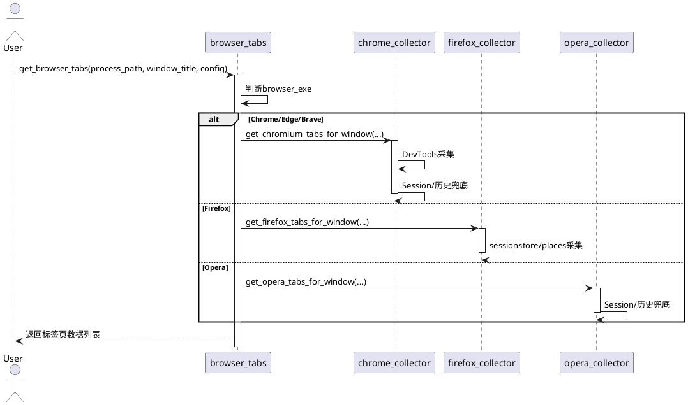
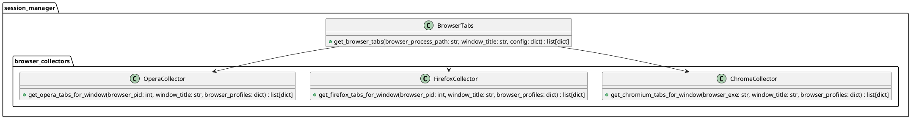
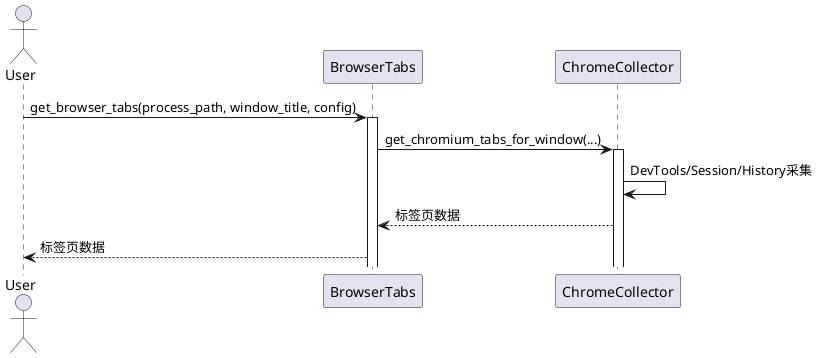
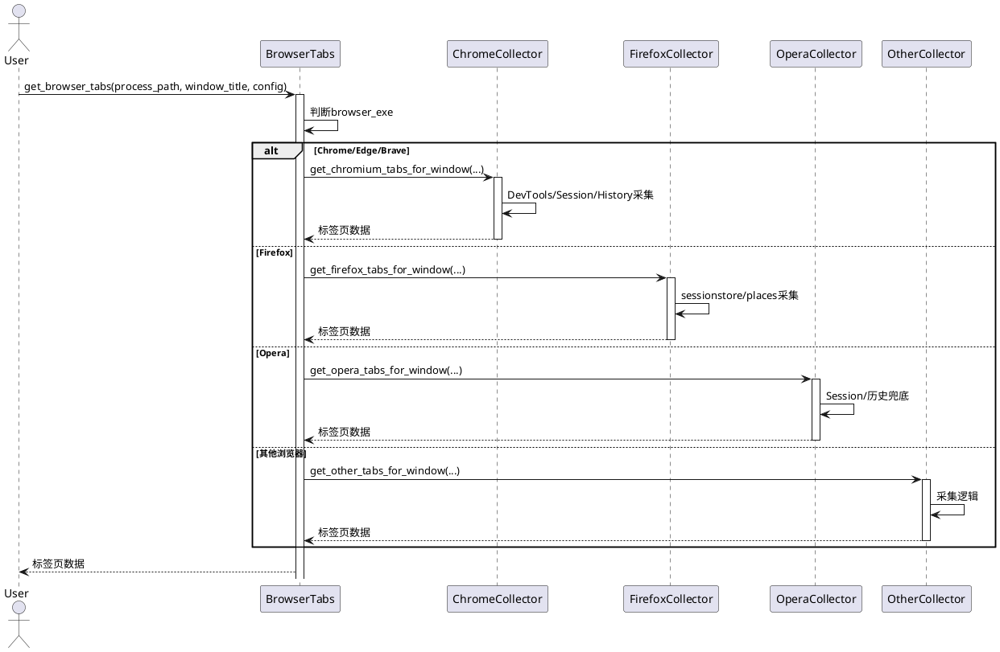

# Windows会话管理器 - 开发与测试文档

## 目录结构

```
project_root/
├── session_manager/
│   ├── browser_tabs.py           # 主调度与通用逻辑
│   ├── browser_collectors/       # 各浏览器采集子模块
│   │   ├── chrome_collector.py
│   │   ├── firefox_collector.py
│   │   └── opera_collector.py
│   ├── core.py
│   ├── gui.py
│   └── ...
├── tests/                       # 自动化测试
│   └── test_browser_collectors.py
├── docs/                        # 文档
│   └── architecture.md
├── requirements.txt
├── README.md
└── ...
```

## 采集模块架构

- 每个浏览器采集逻辑独立于 browser_collectors 子目录，暴露统一接口：
  - `get_xxx_tabs_for_window(browser_pid, window_title, browser_profiles)`
- 主调度 `browser_tabs.get_browser_tabs` 负责分发调用。
- 支持mock测试，便于持续集成。

## 采集流程

1. 用户请求采集某浏览器窗口标签页。
2. `get_browser_tabs` 根据进程名分发到对应采集子模块：
   - Chrome/Edge/Brave → `chrome_collector`
   - Firefox → `firefox_collector`
   - Opera → `opera_collector`
3. 采集子模块内部优先使用 DevTools 协议，兜底 Session 文件/历史记录。
4. 返回统一格式的标签页数据列表。

## 采集接口规范

每个采集子模块应实现如下接口：
```python
def get_xxx_tabs_for_window(browser_pid, window_title, browser_profiles):
    """获取特定浏览器窗口的标签页"""
    return [
        {"title": "页面标题", "url": "https://example.com", "source": "devtools|sessionstore|history|default"},
        ...
    ]
```

## 扩展方法

- 新增浏览器支持：
  1. 在 `browser_collectors/` 下新建 `xxx_collector.py`，实现采集接口。
  2. 在 `browser_tabs.py` 的主调度函数中注册分发。
  3. 补充测试用例。

## 自动化测试策略

- 所有采集模块均应有单元测试，覆盖：
  - 正常采集（可用数据）
  - 异常采集（无数据、路径错误、格式错误等）
  - 采集结果格式校验
  - 主调度分发逻辑
- 推荐使用 pytest + monkeypatch 进行依赖mock。

### 示例测试用例
```python
def test_chrome_collector_devtools(monkeypatch):
    monkeypatch.setattr(chrome_collector, "is_devtools_available", lambda port: False)
    result = chrome_collector.get_chromium_tabs_by_devtools("测试窗口", "chrome.exe")
    assert result is None or isinstance(result, list)

def test_get_browser_tabs_dispatch(monkeypatch):
    monkeypatch.setattr(chrome_collector, "get_chromium_tabs_for_window", lambda a, b, c: ["chrome_tab"])
    assert browser_tabs.get_browser_tabs("chrome.exe", "窗口", {}) == ["chrome_tab"]
```

## 采集结果数据结构

所有采集接口返回的数据结构应为：
```python
{
    "title": "页面标题",
    "url": "https://example.com",
    "source": "devtools|sessionstore|history|default|fallback"
}
```

## 运行与扩展测试

1. 安装pytest
   ```bash
   pip install pytest
   ```
2. 运行所有测试
   ```bash
   pytest tests/
   ```
3. 扩展测试
   - 在tests/目录下添加新测试文件，命名以test_开头。
   - 使用monkeypatch模拟外部依赖，保证测试可重复。

## 贡献与维护建议

- 保持各采集子模块接口一致，便于主调度调用和测试。
- 采集逻辑中应有详细日志和异常处理，便于排查问题。
- 定期补充和完善测试用例，保证功能稳定。
- 文档应随功能变更及时更新。

## 采集模块API详细说明

### 1. 主调度接口 browser_tabs.get_browser_tabs

```python
def get_browser_tabs(browser_process_path, window_title, config) -> List[Dict]:
    """
    获取特定浏览器窗口的标签页信息
    参数:
        browser_process_path: 浏览器进程路径（如 chrome.exe）
        window_title: 窗口标题
        config: 配置信息（可选）
    返回:
        标签页字典列表，每项结构如下：
        {
            "title": "页面标题",
            "url": "https://example.com",
            "source": "devtools|sessionstore|history|default|fallback"
        }
    """
```

### 2. 采集子模块接口（以chrome_collector为例）

```python
def get_chromium_tabs_for_window(browser_exe: str, window_title: str, browser_profiles: dict) -> List[Dict]:
    """
    获取Chromium内核浏览器（Chrome/Edge/Brave）特定窗口的标签页
    参数：
        browser_exe: 浏览器可执行文件名（如 chrome.exe）
        window_title: 目标窗口标题
        browser_profiles: 浏览器配置信息字典
    返回：
        标签页字典列表，结构同上
    """
```

### 3. 采集结果数据结构

```python
{
    "title": "页面标题",
    "url": "https://example.com",
    "source": "devtools|sessionstore|history|default|fallback"
}
```

### 4. 典型异常
- 不支持的浏览器类型 → 返回空列表
- 未找到数据路径 → 返回空或默认标签页
- DevTools端口不可用 → 自动降级Session/历史
- 采集文件损坏/格式错误 → 日志记录并降级

## 采集流程图（文本版）

```
[用户请求采集]
      |
      v
[get_browser_tabs]
      |
      v
[分发到对应采集子模块]
      |
      v
[优先DevTools协议采集] --失败--> [Session文件采集] --失败--> [历史记录采集] --失败--> [返回默认标签页]
      |
      v
[返回标签页数据列表]
```

## 具体模块开发示例

### 新增浏览器采集模块（如Vivaldi）

1. 新建 `session_manager/browser_collectors/vivaldi_collector.py`：
```python
import logging
from typing import List, Dict, Optional
logger = logging.getLogger(__name__)

def get_vivaldi_tabs_for_window(
    browser_pid: Optional[int],
    window_title: str,
    browser_profiles: dict
) -> List[Dict[str, str]]:
    """
    获取Vivaldi特定窗口的标签页
    :param browser_pid: 浏览器进程ID（可为None）
    :param window_title: 目标窗口标题
    :param browser_profiles: 浏览器配置信息字典
    :return: 标签页字典列表，结构同上
    """
    # 1. 优先尝试DevTools协议采集
    # 2. 兜底Session文件/历史记录
    # 3. 返回统一格式
    try:
        # 伪代码示例
        tabs = []
        # ...采集逻辑...
        if tabs:
            return tabs
    except Exception as e:
        logger.error(f"Vivaldi采集异常: {e}")
    return [{"title": "新标签页", "url": "about:newtab", "source": "default"}]
```

2. 在 `browser_tabs.py` 主调度注册：
```python
from session_manager.browser_collectors import vivaldi_collector
...
elif browser_exe == "vivaldi.exe":
    return vivaldi_collector.get_vivaldi_tabs_for_window(None, window_title, browser_profiles)
```

3. 补充测试用例：
```python
def test_vivaldi_collector(monkeypatch):
    from session_manager.browser_collectors import vivaldi_collector
    monkeypatch.setattr(vivaldi_collector, "get_vivaldi_tabs_for_window", lambda a, b, c: ["vivaldi_tab"])
    from session_manager import browser_tabs
    assert browser_tabs.get_browser_tabs("vivaldi.exe", "窗口", {}) == ["vivaldi_tab"]
```

## UML采集流程图（PlantUML文本版）



## 主要接口类型注解

### browser_tabs.py
```python
def get_browser_tabs(
    browser_process_path: str,
    window_title: str,
    config: dict
) -> list[dict]:
    ...
```

### chrome_collector.py
```python
def get_chromium_tabs_for_window(
    browser_exe: str,
    window_title: str,
    browser_profiles: dict
) -> list[dict]:
    ...
```

### firefox_collector.py
```python
def get_firefox_tabs_for_window(
    browser_pid: int | None,
    window_title: str,
    browser_profiles: dict
) -> list[dict]:
    ...
```

### opera_collector.py
```python
def get_opera_tabs_for_window(
    browser_pid: int | None,
    window_title: str,
    browser_profiles: dict
) -> list[dict]:
    ...
```

## API参数详细说明

| 参数名                | 类型         | 说明                                   |
|----------------------|--------------|----------------------------------------|
| browser_process_path | str          | 浏览器进程路径（如 chrome.exe）        |
| window_title         | str          | 目标窗口标题                           |
| config               | dict         | 配置信息（可选，通常为全局配置）       |
| browser_exe          | str          | 浏览器可执行文件名（如 chrome.exe）    |
| browser_pid          | int/None     | 浏览器进程ID（部分采集可为None）       |
| browser_profiles     | dict         | 浏览器配置信息（如数据路径等）         |

### 返回值
- list[dict]，每个dict结构如下：
  - title: str，页面标题
  - url: str，页面URL
  - source: str，采集来源（devtools/sessionstore/history/default/fallback）

## UML类图（PlantUML文本版）



## UML时序图（PlantUML文本版）



## 更详细的类型注解与接口示例

### browser_tabs.py
```python
def get_browser_tabs(
    browser_process_path: str,
    window_title: str,
    config: dict
) -> list[dict[str, str]]:
    """
    获取特定浏览器窗口的标签页信息
    :param browser_process_path: 浏览器进程路径（如 chrome.exe）
    :param window_title: 窗口标题
    :param config: 配置信息（可选）
    :return: 标签页字典列表，每项结构如下：
        {
            "title": "页面标题",
            "url": "https://example.com",
            "source": "devtools|sessionstore|history|default|fallback"
        }
    """
    ...
```

### chrome_collector.py
```python
def get_chromium_tabs_for_window(
    browser_exe: str,
    window_title: str,
    browser_profiles: dict
) -> list[dict[str, str]]:
    """
    获取Chromium内核浏览器（Chrome/Edge/Brave）特定窗口的标签页
    :param browser_exe: 浏览器可执行文件名（如 chrome.exe）
    :param window_title: 目标窗口标题
    :param browser_profiles: 浏览器配置信息字典
    :return: 标签页字典列表，结构同上
    """
    ...
```

### firefox_collector.py
```python
def get_firefox_tabs_for_window(
    browser_pid: int | None,
    window_title: str,
    browser_profiles: dict
) -> list[dict[str, str]]:
    """
    获取Firefox特定窗口的标签页
    :param browser_pid: 浏览器进程ID（可为None）
    :param window_title: 目标窗口标题
    :param browser_profiles: 浏览器配置信息字典
    :return: 标签页字典列表，结构同上
    """
    ...
```

### opera_collector.py
```python
def get_opera_tabs_for_window(
    browser_pid: int | None,
    window_title: str,
    browser_profiles: dict
) -> list[dict[str, str]]:
    """
    获取Opera特定窗口的标签页
    :param browser_pid: 浏览器进程ID（可为None）
    :param window_title: 目标窗口标题
    :param browser_profiles: 浏览器配置信息字典
    :return: 标签页字典列表，结构同上
    """
    ...
```

## 采集子模块接口实现模板

以新增浏览器采集模块（如Vivaldi）为例：

```python
# session_manager/browser_collectors/vivaldi_collector.py
import logging
from typing import List, Dict, Optional
logger = logging.getLogger(__name__)

def get_vivaldi_tabs_for_window(
    browser_pid: Optional[int],
    window_title: str,
    browser_profiles: dict
) -> List[Dict[str, str]]:
    """
    获取Vivaldi特定窗口的标签页
    :param browser_pid: 浏览器进程ID（可为None）
    :param window_title: 目标窗口标题
    :param browser_profiles: 浏览器配置信息字典
    :return: 标签页字典列表，结构同上
    """
    # 1. 优先尝试DevTools协议采集
    # 2. 兜底Session文件/历史记录
    # 3. 返回统一格式
    try:
        # 伪代码示例
        tabs = []
        # ...采集逻辑...
        if tabs:
            return tabs
    except Exception as e:
        logger.error(f"Vivaldi采集异常: {e}")
    return [{"title": "新标签页", "url": "about:newtab", "source": "default"}]
```

## 更复杂的UML时序图（多浏览器分支）



## 开发流程与最佳实践

### 新增浏览器采集支持流程
1. 在 `browser_collectors/` 下新建 `xxx_collector.py`，实现采集接口。
2. 在 `browser_tabs.py` 的主调度函数中注册分发。
3. 补充/修改 `BROWSER_PROFILES` 配置。
4. 编写/扩展自动化测试用例。
5. 更新开发文档和README。

### 代码风格与协作建议
- 所有接口应有类型注解和详细docstring。
- 采集逻辑中应有try/except和详细日志，便于排查。
- 测试用例应覆盖正常、异常、边界场景。
- 重要变更应同步更新文档。

### 贡献指南片段
- 新增功能请先在`docs/architecture.md`补充设计说明。
- 提交PR前请确保所有测试通过。
- 代码需通过PEP8风格检查。
- 建议在PR描述中附带采集结果示例。

---
如需更详细的模块开发流程、团队协作规范或CI/CD集成建议，请继续告知！ 